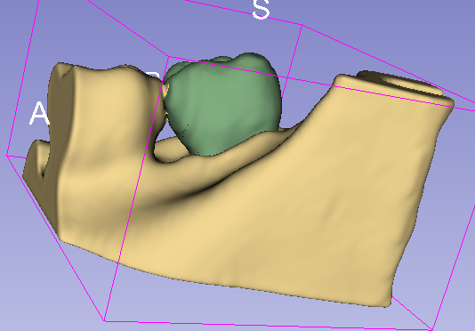
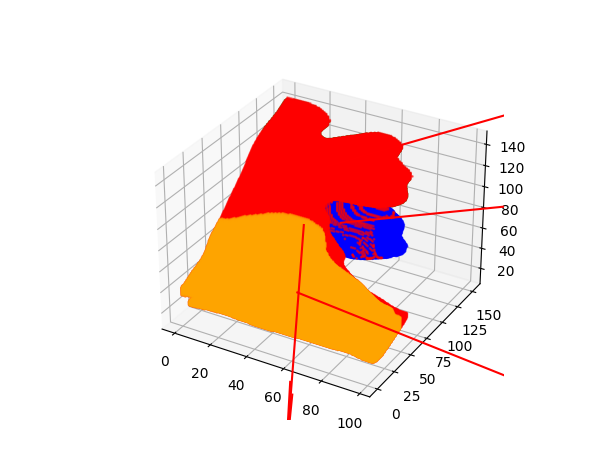

# PCA-project
This repository shows some interesting experiments about principle component analysis(PCA) done by myself

## First Experiments: Finding principle axis
I aim to determine the principle axis of  , 
, which is a 3D medical image. However, I lack an effective method to calculate its principal axis directly. Hence, I employ PCA to identify its principal axis.

The approach is as follows: treating each pixel (voxel) as a sample. For instance, if the image size is 240x240x240, then I have $240^3$ samples, with the coordinate information serving as features. The purpose of PCA is to reduce feature dimensionality. Given that the image has three orthogonal axes, if I can identify a principal eigenvector and align along its direction, it would represent the principal axis.

Below are the results, where I manually segment each part and identify its principal axis.

## Second Experiments: image compression and reconstruction

Here's the refined version:

This project utilizes Principal Component Analysis (PCA) for image compression and reconstruction. I employed PCA to compress and reconstruct the image exemplified by 
 .
. The original image has dimensions of 316x316 pixels. Initially, I considered the entire image as a single sample, with each pixel serving as a feature, resulting in a total of $316^2$ features. However, this approach proved computationally intensive, necessitating a more efficient strategy.

To mitigate computational complexity, I devised a method to partition the image into smaller blocks. Each block measures 4x4 pixels, reducing the feature count to 16 per block, and treating each block as an individual sample. Consequently, the image was segmented into $79^2$ blocks.

Below are the results of this approach:

