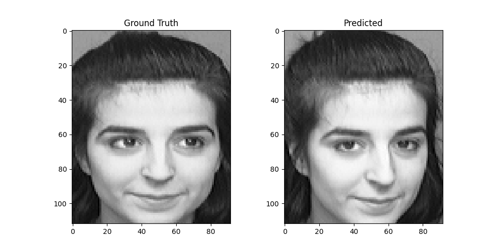

# PCA-project
This repository shows some interesting experiments about principle component analysis(PCA) done by myself

## First Experiments: Finding principle axis
I aim to determine the principle axis of  , 
, which is a 3D medical image. However, I lack an effective method to calculate its principal axis directly. Hence, I employ PCA to identify its principal axis.

The approach is as follows: treating each pixel (voxel) as a sample. For instance, if the image size is 240x240x240, then I have $240^3$ samples, with the coordinate information serving as features. The purpose of PCA is to reduce feature dimensionality. Given that the image has three orthogonal axes, if I can identify a principal eigenvector and align along its direction, it would represent the principal axis.

Below are the results, where I manually segment each part and identify its principal axis.

## Second Experiments: image compression and reconstruction

Here's the refined version:

This project utilizes Principal Component Analysis (PCA) for image compression and reconstruction. I employed PCA to compress and reconstruct the image exemplified by 
 .
. The original image has dimensions of 316x316 pixels. Initially, I considered the entire image as a single sample, with each pixel serving as a feature, resulting in a total of $316^2$ features. However, this approach proved computationally intensive, necessitating a more efficient strategy.

To mitigate computational complexity, I devised a method to partition the image into smaller blocks. Each block measures 4x4 pixels, reducing the feature count to 16 per block, and treating each block as an individual sample. Consequently, the image was segmented into $79^2$ blocks.

Below are the results of this approach:

## Second Experiments: Face Recognition with Principal Component Analysis (PCA)

### Introduction

This project focuses on implementing a face recognition system using Principal Component Analysis (PCA). Face recognition is a popular application of machine learning and computer vision, which involves identifying and verifying individuals based on their facial features. PCA is a dimensionality reduction technique commonly used in face recognition to extract the most important features from high-dimensional data.

### Dataset

The ORL face dataset contains a total of 400 images of 40 different people and was created between April 1992 and April 1994 at the Olivetti Research Laboratory in Cambridge, UK.

 This data set contains 40 directories, each directory has 10 images, and the directory represents a different person. All images are stored in PGM format, grayscale, and the image size is 92 in width and 112 in height. For each category of images, these were collected at different times, with different eyes, with different facial expressions (eyes open/closed, smiling/not smiling) and facial details (with glasses/without glasses). The images were taken against a dark, uniform background, showing the face from the front (some with a slight side tilt).
### Implementation

#### 1. Data Preprocessing

- The dataset is preprocessed to extract features from the facial images. Each image is flattened into a one-dimensional array, with pixel values serving as features.

#### 2. Principal Component Analysis (PCA)

- PCA is applied to the training set to extract the principal components that capture the most significant variations in the data.
- The number of principal components is selected based on the desired level of variance retention or computational constraints.

#### 3. Training

- The training set is projected onto the principal components obtained from PCA to reduce the dimensionality of the data.

#### 4. Testing

- The testing set is preprocessed and projected onto the same principal components obtained from the training set.
- For each test sample, the distances between its reduced-dimensional representation and the representations of all training samples are computed.
- The label of the nearest neighbor in the training set is assigned to the test sample based on the minimum distance.
- The accuracy of the face recognition system is evaluated based on the agreement between the predicted labels and the ground truth labels.

### Results

The effectiveness of the face recognition system is assessed based on metrics such as precision, recall, and accuracy. The performance of the system may vary depending on factors such as the size and quality of the dataset, the choice of dimensionality reduction technique, and the classifier used for training.

### Conclusion

Face recognition using PCA offers a powerful approach for identifying individuals based on facial features. By reducing the dimensionality of the data and extracting the most informative features, PCA enables efficient and effective face recognition systems. Continued research and experimentation are essential for further improving the accuracy and robustness of face recognition algorithms.
"""

### test_result

